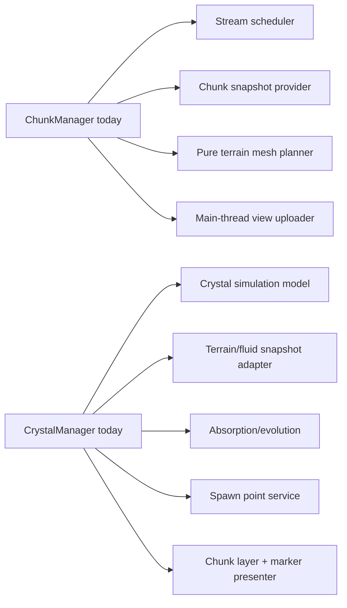

# Principal engineering audit

**Scope:** repository source, production scene, configuration, developer tooling, and verification manifest reviewed 2026-07-11. This is a static architecture audit supplemented by the existing verification inventory; it does not claim a fresh interactive performance benchmark. Findings distinguish confirmed code structure from risks that require profiling or human validation.

## Executive assessment

The project has a coherent gameplay prototype and unusually strong targeted regression coverage, but its architectural center is fragile. It relies on mutable static overlays, group-based service location, deferred polling, and a few very large orchestration classes. The dominant risk is not a single slow algorithm; it is that a seemingly local terrain, crystal, visual, or configuration change crosses many implicit contracts without compiler-visible dependency boundaries.

The recommended strategy is **boundary hardening, not wholesale replacement**: establish explicit ownership/readiness contracts around the existing chunk, crystal, overlay, and configuration systems; measure first; then split high-centrality classes along data/query/render responsibilities.

## Ranked findings

| Rank | Finding | Severity | Evidence | Recommended direction |
|---|---|---|---|---|
| 1 | Mutable process-global overlay state is the canonical world state. | Critical | `TerrainEdits`, `FeatureRegistry`, `ChannelRegistry`, `BiomeLayout`, `WorldSettings`, and registries use static mutable state; chunk workers snapshot only selected overlay data. | Introduce an explicit world-state ownership boundary with versioning/revision IDs. Retain static facades temporarily, but make reads/writes and worker snapshots versioned and testable. |
| 2 | `CrystalManager` is a God Object spanning simulation, gameplay, visuals, persistence, and spawning. | Critical | 1,417 lines; owns fluid sim, terrain query, cells, layers, marker materials, absorption/evolution, spawn controller, chunk binding, player contact, imports/exports. | Split into simulation state/service, absorption/evolution service, spawn-point service, and crystal visual presenter behind a narrow façade. |
| 3 | `ChunkManager` conflates streaming, job scheduling, terrain meshing, ramps, rebuild policy, rendering upload, and teardown. | Critical | 1,218 lines; worker scheduling, meshing, terrain geometry decisions, view creation, budgets, and lifecycle signals in one class. | Extract pure mesh planning/building and a stream scheduler; keep manager as lifecycle coordinator. Add explicit chunk revision and cancellation semantics. |
| 4 | Runtime dependencies are largely implicit through scene groups and polling. | High | 248 `get_first_node_in_group` calls in non-script runtime source; many `call_deferred` / frame-await binding loops. | Add a composition-root service container or explicit dependency handoff at bootstrap. Preserve groups for discovery/debug only; replace hot-path and critical-startup lookups first. |
| 5 | Initialization is a distributed async state machine with known cycle hazards. | High | `WorldFeatures` waits config/performance/textures; `VoxelWorld` waits features before chunks; visuals later wait chunks. Existing comments explicitly avoid a visual/chunk deadlock. | Formalize boot stages and readiness states in one coordinator with timeouts, diagnostics, and one-way stage transitions. Keep the texture-only readiness distinction. |
| 6 | Configuration and runtime policy ownership overlap. | High | `ConfigService` pushes config to systems; `PerformanceService` mutates many systems and writes `cfg_svc.world_gen.caves_enabled`; config has performance and gameplay values. | Separate immutable authored configuration from runtime quality overrides. Compute an effective runtime policy rather than mutating authored world-gen config. |
| 7 | Terrain model abstraction is internally inconsistent. | High | Active chunks are 16×16 height/tile maps and a one-surface-layer renderer; code/docs retain 3D voxel/cave APIs and legacy bounds. | Publish one authoritative terrain capability contract: heightfield edits, optional cave query/render support, and unsupported full-volume operations. Remove/rename compatibility APIs only after migration. |
| 8 | Terrain edits trigger expensive derived-state fan-out. | High | Edit overlays affect chunk snapshots/meshing, player floor probing, crystal terrain query, map, visuals, save, and entity navigation. Chunk rebuild APIs include region rebuilds; manual notes flag rebuild behavior. | Add revisioned invalidation domains and profile edit-to-visible latency. Prioritize coalesced edit transactions and partial rebuilds only where measurements justify complexity. |
| 9 | Crystal simulation has an exceptionally broad, main-thread-sensitive integration surface. | High | Crystal tick reads terrain/features/channels/buildings/plants, updates dirty chunk layers, absorption, spawns, player interaction, map/save consumers; multiple per-frame caps exist. | Isolate pure simulation input snapshots from presentation. Profile query cost, frontier growth, and mesh-update cost independently; introduce telemetry for each. |
| 10 | Visual ownership is split across three coordinators. | Medium | `GameVisualRegistry` generates/caches/refreshes assets, `WorldVisuals` owns layer roots/boot, `FeatureVisualLayer` owns chunk feature population; crystal also owns layers/markers. | Define a `VisualPresentation` boundary: registry owns assets, layer root owns lifetime, presenters own content. Eliminate broad “refresh all visuals” fan-out over time. |
| 11 | Fluid architecture has overlapping concepts without a clean product boundary. | Medium | `VoxelFluidEngine` backs both `CrystalFluidSim` and `VoxelFluidService`; crystal additionally has terrain/absorption/spawn/render ownership. | Keep the generic engine, but document/encode an explicit fluid adapter interface. Ensure channel water and crystal never bypass a single terrain/fluid query contract. |
| 12 | Verification is rich but release automation and quality gates are incomplete. | Medium | 80 `verify_*.gd` scripts and shell runner exist; no CI configuration/Makefile/task runner found. Some probes accept terminal markers due to teardown abort behavior. | Add CI that installs/pins Godot, runs the manifest, archives logs/evidence, enforces no `.godot` changes, and reports test duration/flakes. Preserve manual visual gate separately. |

## Detailed findings

### 1. Global overlays and hidden state — Critical

`TerrainEdits`, `FeatureRegistry`, and `ChannelRegistry` are correct conceptual stores, but their static mutable implementation makes them ambient state. `InfiniteNoiseWorld`, `ChunkData`, `CrystalTerrainQuery`, terrain editing, map building, save/load, vegetation, entities, and feature seeding all touch them. Chunk generation avoids direct worker races by snapshotting a subset immediately before dispatch, but that is an implicit consistency model: an edit made while a job runs is necessarily absent from that job until a subsequent rebuild wins.

Risks:

- No explicit world/session ownership; multiple worlds, parallel tests, or reloads rely on manual `reset` discipline.
- No shared revision number to determine whether a generated chunk is stale because its inputs changed.
- Save/load and feature seeding can leave consumers observing an overlay midway through restoration unless ordering stays exact.
- Static cache invalidation is distributed and easy to omit.

Recommendation: introduce a `WorldState` node/service that owns overlays, exposes immutable snapshots plus monotonic revisions, and publishes typed change events. Keep static calls as migration shims, but prohibit new static mutation APIs. First use revisions to reject stale worker results beyond coordinate/token cancellation.

### 2–3. God Objects: crystal and chunks — Critical

`CrystalManager` (1,417 lines) owns both model and presentation: it advances flow, tracks cells and power, absorbs features, manages spawn points/evolution, binds chunks, rebuilds crystal meshes, creates marker materials, handles player contact, and serializes state. This makes it difficult to test the model without a scene tree and difficult to change visuals without affecting gameplay sequencing.

`ChunkManager` (1,218 lines) similarly owns stream selection, worker lifecycle, greedy mesh decisions, ramp policy, rebuild batching, upload scheduling, `ChunkView` creation, chunk query APIs, and teardown. Its worker/main-thread boundary is a critical correctness concern, yet it is embedded in broader orchestration.

Recommended target seams:

Do not split these classes by moving methods mechanically. First create explicit interfaces/data structures and maintain behavior with existing verification. The first extraction should be pure/model-only, reducing scene-tree and group access in tests.

### 4–5. Implicit dependency injection and boot complexity — High

Groups are used as a service locator across nearly every system. This is convenient for dynamic scene composition but makes dependencies invisible, permits `null`/late binding paths, and introduces polling loops such as `while ... await process_frame`. There are many deferred binds in terrain, entities, crystal, visuals, camera, UI, save, performance, and world systems.

The boot chain currently works because of careful special cases. The important cycle is:

`GameVisualRegistry.ensure_textures_ready` deliberately avoids waiting for chunks, breaking the cycle. This is a fragile protocol encoded in method naming/comments rather than a formal state model.

Recommendation: introduce explicit bootstrap states (`CONFIGURED`, `QUALITY_APPLIED`, `FEATURES_SEEDED`, `CHUNKS_CREATED`, `INITIAL_STREAM_READY`, `VISUALS_COMMITTED`) and a dependency graph owned by the main composition root. Add timeouts with a state dump, not unbounded frame polling. Existing groups can remain for compatibility during migration.

### 6. Configuration versus performance mutation — High

`ConfigService` applies authored game/world/simulation/content configuration. `PerformanceService` also mutates runtime systems across chunks, world caves, crystal, maps, visuals, entities, vegetation, debug/profiling—and currently assigns `cfg_svc.world_gen.caves_enabled` while applying quality.

This merges two different questions: “what is the world’s authored behavior?” and “what can this machine render now?” It can confuse save/replay determinism and makes reapplication order significant.

Recommendation: model runtime quality as a read-only overlay or calculated `EffectiveRuntimePolicy`, separate from `WorldGenConfig`. Systems should receive both authored configuration and quality policy, with a documented precedence rule.

### 7. Heightfield/volumetric abstraction debt — High

The active runtime is intentionally optimized around a 2D surface map plus generated sides and ramps. `ChunkData` comments describe removed 3D storage and compatibility APIs; `InfiniteNoiseWorld` retains volumetric cave concepts; collision/query code contains cave branches. Historical documentation also disagrees on dimensions and biome labels.

This is not inherently wrong—the heightfield is a valid performance choice—but the API surface implies a more general voxel world than is implemented. It invites features to call “voxel” methods whose semantics are surface-only/no-op.

Recommendation: publish a terrain capability matrix and rename/deprecate misleading APIs. Decide explicitly whether caves are render/query-only or fully editable/interactive. Add contract tests that make unsupported operations fail loudly rather than silently no-op.

### 8–9. Derived-state and simulation performance risks — High

Current performance protection is thoughtful: chunk upload budgets, inflight limits, prebuilt buffers, map time budgets, crystal flow/new-cell caps, loaded-chunk policy, dirty depth thresholds, entity/vegetation caps, and safe mode. The remaining risk is cross-system fan-out rather than a missing knob.

Key hotspots to measure before redesign:

| Path | Why risky | Required telemetry |
|---|---|---|
| Dig/build → visible terrain | Overlay mutation, cache invalidation, chunk/neighbor rebuild, upload, collision/query changes | edit-to-mesh latency, chunks rebuilt, worker time, upload time, frames above budget. |
| Crystal tick | Terrain/feature/channel queries plus frontier growth, absorption, dirty layer updates | query time, cells processed/created, absorption time, dirty chunks, partial/full mesh rebuild time. |
| Visual refresh | Registry can refresh all entities/enemies/spawn markers/features/VFX | nodes visited, textures generated, allocations, refresh duration. |
| Save/load | Overlay import, cache invalidation, chunk rebuild idle wait, runtime rehydration | restore duration by phase and failure/timeout observability. |

The code has `PerfProfiler`, but no visible CI/perf-budget artifact or standardized per-subsystem metrics contract. Add counters and structured timing before moving simulation to a thread; this code has significant scene/static state coupling and is not thread-ready by assumption.

### 10–11. Presentation and fluid boundaries — Medium

The visual stack is functionally layered but ownership overlaps. `GameVisualRegistry` owns generated asset cache and triggers broad refresh; `WorldVisuals` owns physical layer roots and bootstrap; `FeatureVisualLayer` owns population; crystal creates its own chunk layers and markers; combat creates VFX. A defined asset/lifetime/presenter division would reduce refresh storms and duplicate bindings.

The generic `VoxelFluidEngine` is a positive abstraction used by channel water and crystal, but crystal additionally owns domain rules through `CrystalTerrainQuery`, evolution, spawn pressure, and custom rendering. The risk is not immediate duplication; it is future bypassing of water/crystal terrain semantics. Establish an adapter contract and document which behavior belongs in generic fluid math versus crystal domain policy.

### 12. Automation gaps — Medium

The test suite is a strength: 80 focused verification scripts plus smoke/display/manual scaffolding. However, no CI definition, task runner, pinned engine acquisition, artifact policy, or flake/duration reporting was found. The full script handles selected successful probes by matching an OK marker because teardown can abort; this is a pragmatic workaround but should be surfaced as monitored technical debt.

Recommended automation backlog:

1. CI pipeline runs `scripts/run_all_verify.sh` in a pinned Godot container/image and uploads terminal output/evidence.
2. Separate fast PR subset from nightly display/smoke/performance subset; publish timing and flaky-test history.
3. Add static checks: GDScript parse/load, scene resource validation, duplicate input-action checks, forbidden production references to `archive/legacy`, and tracked `.godot` detection.
4. Add save-schema/version migration tests and deterministic seed/golden-query tests.
5. Produce a machine-readable test manifest instead of maintaining suite lists only in shell.

## Duplicate systems and poor abstractions

| Area | Assessment | Priority |
|---|---|---|
| Crystal versus water fluid | Shared `VoxelFluidEngine` is not duplicate code, but domain boundary is incomplete. | Medium |
| Config versus quality policy | Overlapping setters and direct config mutation are duplicate ownership. | High |
| Visual coordinators | Asset, root-lifetime, and content-population responsibilities overlap. | Medium |
| Terrain ramp logic | `TerrainRamps`, `ChunkManager`, movement/targeting, meshing, and tests share ramp rules. Central helper exists, but manager retains substantial policy. | Medium |
| Terrain query paths | World, loaded chunk data, floor probe, action targeting, crystal terrain query, and entity navigation each resolve related terrain state. | High |
| Developer/tool surfaces | Dev chat slash commands, coordinator hotkeys, debug panel, scenarios, scripts, and editor plugin are useful but lack one discoverable command/test catalogue. | Low |

The top abstraction improvement is a shared read-only terrain query interface that has explicit loaded-chunk, worker-snapshot, and live-world implementations. It should be introduced carefully because these call sites have different correctness/performance constraints.

## Dead code and stale-artifact candidates

These are candidates, not deletion instructions. Confirm references, editor use, and release requirements before removal.

| Candidate | Evidence | Action |
|---|---|---|
| `scenes/world_viewer.tscn` / `world/world_viewer.gd` | Development viewer only; not production main scene. | Keep if actively used for world design; otherwise move under a clearly named dev-tools area and add a launch command. |
| `archive/` | Contains only `.gdignore` in current working tree. | Remove empty historical directory only with explicit history/release approval. |
| Root historical documentation | README implementation claims and some architecture counts conflict with live source/runner. | Assign documentation ownership; reconcile intentionally, preserving historical notes where valuable. |
| Compatibility terrain APIs/comments | `ChunkData` retains surface-only/no-op compatibility behavior alongside cave/3D language. | Deprecate or fail loudly after an API migration audit. |
| `RelicManager` | Is actually dynamically owned by `Player`; not dead. Its gameplay use is limited but code is reachable. | Do not delete; add progression/content tests before expanding it. |
| Editor texture plugin | Not runtime gameplay code. | Keep isolated as editor-only; test plugin load separately if it is a supported workflow. |
| Composer logs / game output | Root text artifacts exist outside engine architecture. | Decide retention/ignore policy; keep generated session logs out of source control. |

## Missing tools

- A bootstrap-state inspector that shows which readiness stage and dependency is waiting.
- A world-overlay inspector: revisions, recent changes, snapshot age, cache invalidations, and chunk rebuild reasons.
- Chunk profiler overlay: requested/generated/uploaded/unloaded counts, queue length, stale drops, worker/mesh/upload timing.
- Crystal profiler: frontier size, tick cost, dirty chunks, partial/full rebuild count, absorption budget use.
- Save/load transaction diagnostics with schema version and stage timings.
- One command catalogue covering input bindings, dev-chat slash commands, scenario presets, headless probes, display probes, and editor tools.
- Seed reproduction package: seed + config + overlay snapshot + player position + performance policy.

## 90-day modernization sequence

### Phase 1 — make implicit behavior observable

Add structured telemetry and boot-state diagnostics; add CI and a test manifest; document terrain capabilities and configuration precedence. No behavior rewrite.

### Phase 2 — create safe seams

Introduce `WorldState` overlay revisions and snapshot contracts. Extract pure chunk mesh planning and pure crystal simulation input/output data from scene-owning managers. Preserve existing manager façades and regression suite.

### Phase 3 — reduce orchestration scope

Move crystal presentation/spawn/evolution and chunk stream/upload responsibilities behind dedicated services. Replace critical group lookups with explicit handoff from the composition root. Retain groups only as compatibility/discovery adapters.

### Phase 4 — optimize with evidence

Use recorded edit, crystal, stream, refresh, and load metrics to decide on incremental meshing, simulation threading, cache redesign, or visual batching. Require deterministic and save/load regression coverage for each optimization.

## Review gate for major changes

Before approving terrain, crystal, streaming, config, or visual architecture changes, require:

- An explicit authoritative-state and derived-state diagram.
- Thread-ownership and snapshot/revision explanation.
- Effects on save/load and deterministic seed behavior.
- Performance preset impact and measured budget data.
- Targeted regression tests plus full headless-suite result.
- Human verification plan when visuals, targeting, collision, or play-feel change.
