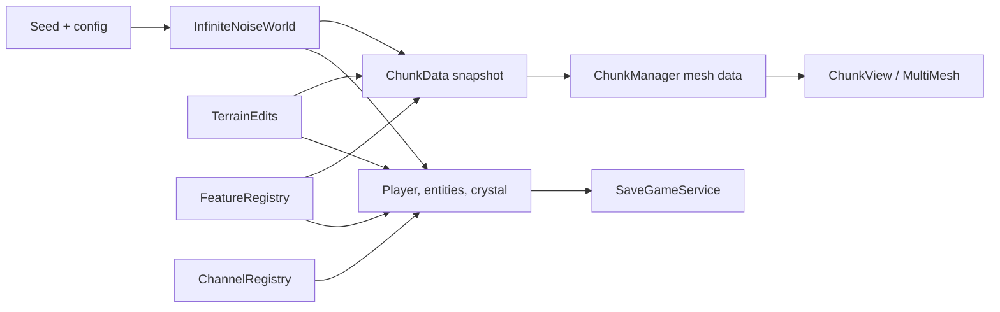
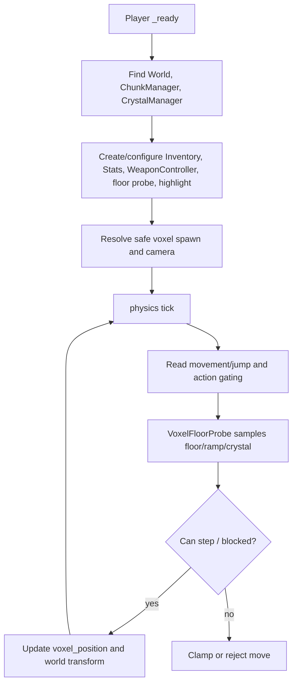
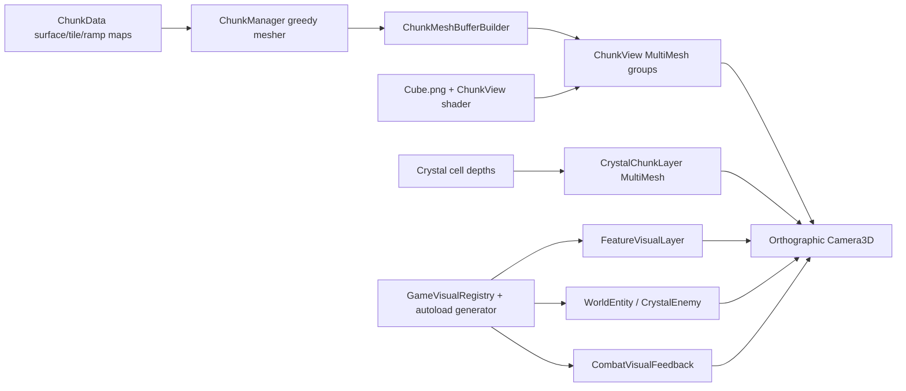
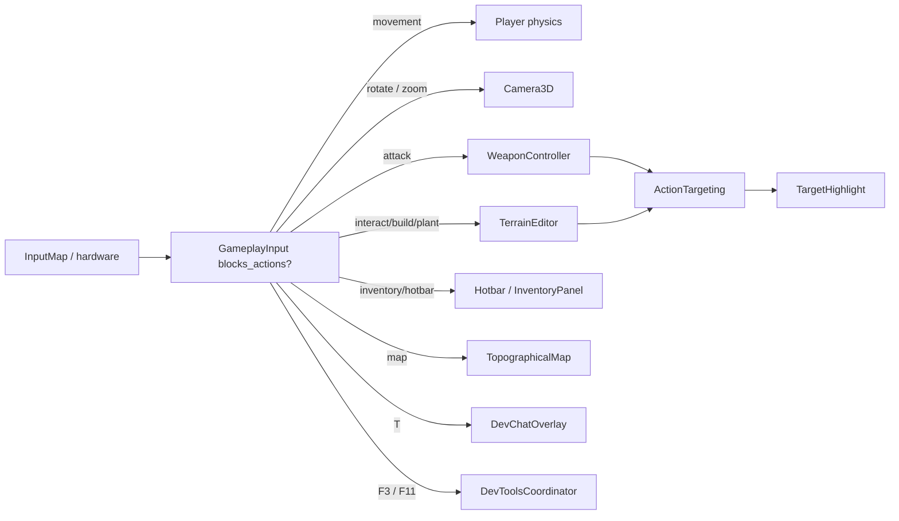
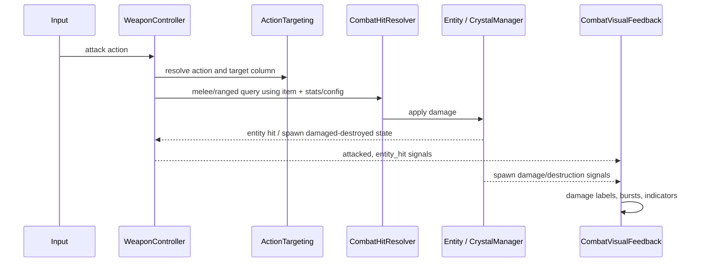
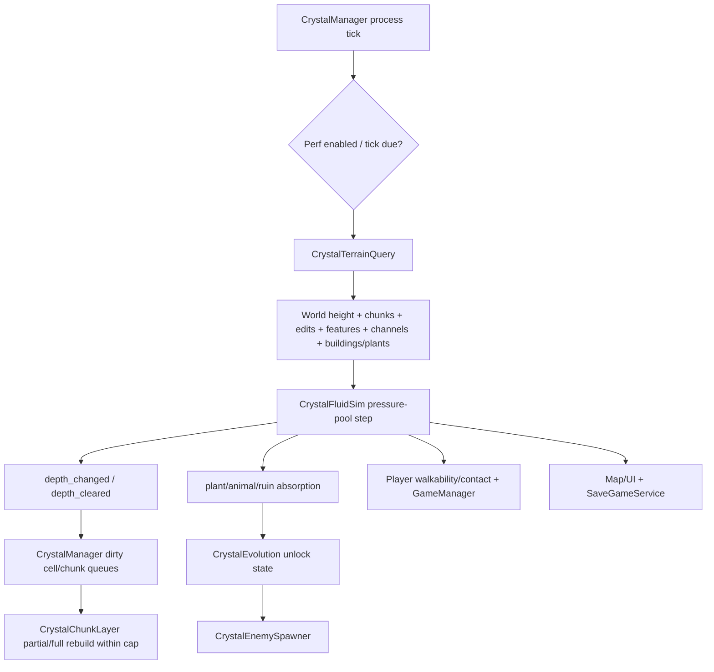
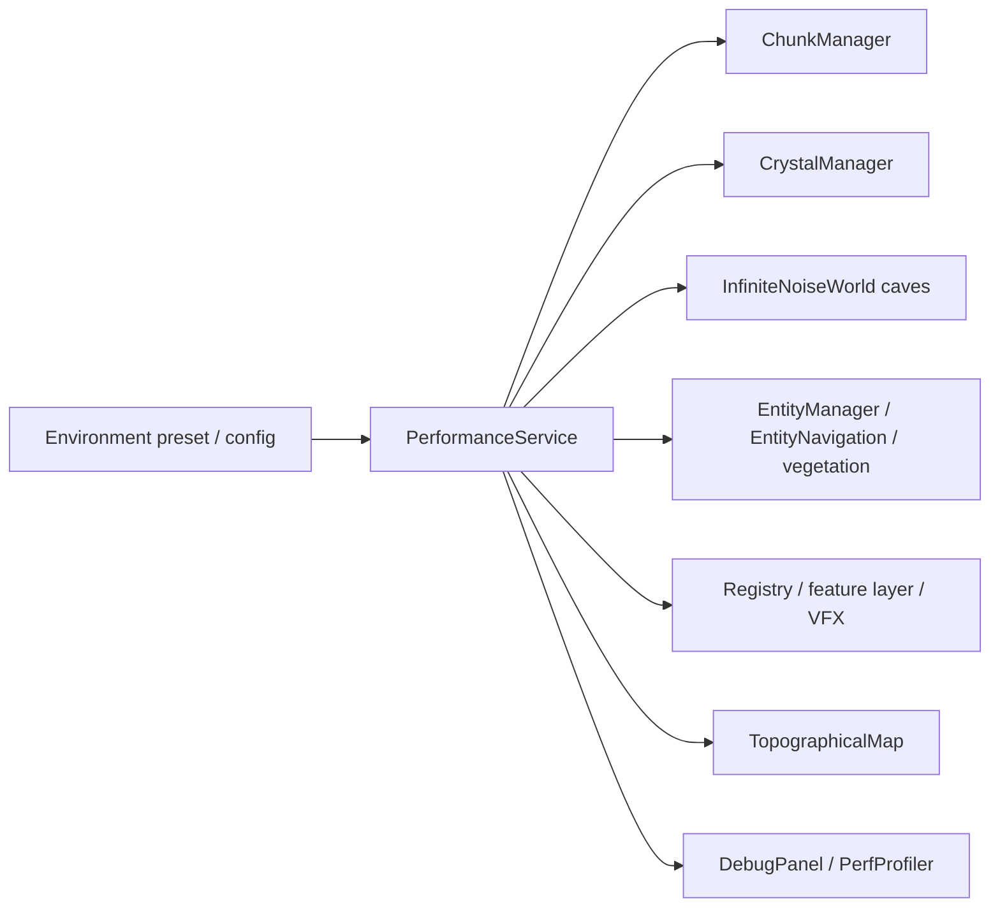

# Engine architecture

This guide is for senior engineers changing the live Godot 4.6 runtime. It describes the production path in `scenes/main.tscn`; consult [PROJECT_GRAPH.md](PROJECT_GRAPH.md) for the full ownership and communication graph, and `AGENTS.md` for mandatory project conventions.

## Operating model

Crystalstorm is a streamed 3D **heightfield voxel renderer** with custom terrain-aware movement. Its canonical world state is not the visible mesh:

- `InfiniteNoiseWorld` deterministically answers base terrain queries from the seed/config.
- `TerrainEdits`, `FeatureRegistry`, and `ChannelRegistry` are mutable process-global overlays.
- `ChunkData` snapshots relevant overlays for worker generation; `ChunkManager` turns results into views.
- Crystal, player collision, entities, map, saves, and tools read the same world/overlay state through their own query paths.

Rendering is therefore a derived, streamed representation. Do not make gameplay state authoritative in `ChunkView`, `MultiMeshInstance3D`, or any visual layer.



## Startup sequence

The scene is authored in a dependency-friendly sibling order, but startup correctness comes from groups, deferred initialization, and explicit readiness waits. Do not assume a sibling can be used merely because its node exists.

```mermaid
sequenceDiagram
  participant A as Autoloads
  participant C as ConfigService
  participant P as PerformanceService
  participant V as GameVisualRegistry
  participant F as WorldFeatures
  participant VW as VoxelWorld
  participant CM as ChunkManager
  participant R as Runtime consumers
  A->>A: Create CrystalTextureGenerator and PerfProfiler
  C->>C: Default/validate GameConfig; activate WorldSettings; populate registries
  C->>P: Apply configured quality
  P->>P: Choose env/default preset; defer apply to scene
  V->>V: Wait for performance; build texture bundle
  F->>F: Wait for config, applied performance, texture readiness
  F->>F: Reset and seed features/channels; safe mode skips content seeding
  VW->>F: await ensure_ready()
  VW->>CM: instantiate and add ChunkManager
  CM->>CM: find World and Player groups; request initial stream
  VW->>R: bind manager to terrain, entities, visuals, VFX, config, performance
  CM-->>R: chunk_ready / chunk_unloaded
  R->>R: crystal, UI, visuals and entities complete lazy binding
```

### Critical boot contracts

1. `ConfigService` creates defaults, activates `WorldSettings`, populates static registries, and pushes settings to any currently available systems.
2. `PerformanceService` selects SAFE/LOW/MEDIUM/HIGH from environment (`CRYSTALSTORM_SAFE_MODE`, `CRYSTALSTORM_PERF_PRESET`) or MEDIUM default. Its scene application is deferred.
3. `WorldFeatures` requires configuration, applied performance, texture readiness, and world availability before it resets/seeds overlays.
4. `VoxelWorld` must wait for feature seeding before creating `ChunkManager`; otherwise generated chunks can miss deterministic features.
5. `WorldFeatures.on_chunk_manager_ready` is the binding fan-out: config, terrain editor, entity manager, visual registry, world visuals, combat VFX, and performance receive the manager.

`GameVisualRegistry.ensure_textures_ready()` intentionally means *textures only*. It must not wait for chunks during world-feature bootstrap because `VoxelWorld` creates chunks only after that bootstrap. Full visual commit happens later, after initial chunks exist.

## Chunk lifecycle

`ChunkManager` is owned dynamically by `VoxelWorld` and is the only runtime owner of chunk views. It publishes `chunk_ready(coord, data)` and `chunk_unloaded(coord)` for crystal, entities, visuals, and feature population.

```mermaid
stateDiagram-v2
  [*] --> Requested: player enters stream region / rebuild request
  Requested --> Snapshotted: ChunkData.capture_worker_snapshot()
  Snapshotted --> WorkerQueued: WorkerThreadPool.add_task
  WorkerQueued --> Generated: worker computes maps + mesh payload
  Generated --> CompletionQueued: token checked on main thread
  CompletionQueued --> Visible: instantiate ChunkView; upload MultiMesh buffers; emit chunk_ready
  Visible --> RebuildRequested: terrain/config/neighbor change
  RebuildRequested --> Requested
  Visible --> Unloaded: outside stream radius
  Unloaded --> [*]: queue_free view; emit chunk_unloaded
```



### Generation and meshing

- `ChunkData.SIZE` is 16 columns per side. It stores 16×16 surface/tile maps, ramp entries, geometry kinds, worker snapshots, and halo data.
- On the main thread, `capture_worker_snapshot()` copies terrain height deltas, build tiles, feature tile overrides, and a one-cell surface halo. Worker code must use these snapshot/uncached paths rather than live static overlay data.
- Worker generation uses `InfiniteNoiseWorld` worker-safe calls to calculate surfaces and tile types. It also prepares greedy mesh payloads when enabled.
- Mesh construction emits ramps/concave geometry, edited strata, greedy top rectangles, side lips, cardinal ramp flanks, and optionally cave faces. Bottom faces are not emitted on the main heightfield path.
- `ChunkMeshBufferBuilder` packs transforms/custom atlas data. `ChunkView` chooses a shared primitive mesh per geometry group and uploads a `MultiMeshInstance3D` under `LayerContainer` with the atlas material.

### Streaming, rebuild, and teardown rules

- `update_stream` is keyed to player chunk changes; it requests needed chunks and unloads those beyond the configured radius.
- Generation results carry monotonic tokens. A stale result is dropped if a chunk was superseded/unloaded while worker work was running.
- Main-thread work is budgeted: frame chunk count, inflight jobs, upload microseconds, and prebuilt buffers are controlled by the active performance configuration.
- Terrain edits trigger `rebuild_chunk_at_world` / region rebuilds. Treat the full region and its neighbours as potentially affected because mesh sides/ramp decisions use adjacent columns.
- `_exit_tree` calls `release_all_chunks_for_teardown`, invalidates token ownership, waits worker tasks, detaches views, and clears queues. This exists partly to prevent headless teardown failures; do not bypass it.

## Player lifecycle

`Player` is a `CharacterBody3D`, but its locomotion is custom voxel-aware logic rather than stock `move_and_slide` movement. It dynamically owns support nodes such as weapon/stat/targeting helpers and exposes the `player` group.



### Locomotion and collision

`VoxelFloorProbe` is the shared surface model for player and entity navigation. It resolves a column’s base surface through loaded `ChunkData` when available, falls back to world queries, handles landing ramps, optional cave floors, and crystal walkable height. Its multi-offset samples support grounded, step, and blocked checks.

Coordinate conversion is governed by `WorldSettings`. Keep logical column/voxel position distinct from Godot world-space transforms; use `WorldVisualCoords` and settings conversion helpers for visual placement.

`Camera3D` is an orthographic player child. It supports wheel zoom and 90-degree rotation steps, which means screen direction cannot be assumed to be world north. Targeting and combat must derive orientation from camera/player state.

## Terrain generation

`InfiniteNoiseWorld` owns deterministic terrain logic. It is initialized with a seed, creates FastNoiseLite generators, applies optional world settings/config, and caches hot column queries. Key inputs:

- Domain-warped base height, detail, temperature, moisture, and ridged border terrain.
- `BiomeLayout` for deterministic interior biome regions.
- Dedicated river noises and carved channels/river tile selection.
- Optional three-dimensional cave queries; cave mesh rendering remains performance-configurable and separate from the heightfield surface path.
- `WorldBorder` for playable limits, ocean/border mountain treatment, and movement constraints.
- `TerrainEdits` and feature tile overrides applied above base terrain.

For any new query, provide a worker-safe pure version if it will be called by chunk generation. Cache mutation and direct scene/group access are main-thread concerns.

## Rendering pipeline



Terrain uses `ChunkView.gdshader` plus a 7×10 atlas binding, face-coded custom data, nearest filtering, and simple face-based presentation. The active performance strategy is few scene nodes with MultiMesh groups, not a node per voxel.

`WorldVisuals` owns explicit layer roots: `Entities`, `Vegetation`, `Buildings`, `SpawnMarkers`, and `CombatVFX`; `FeatureVisualLayer` populates feature renderables. Dynamic visual systems must attach under the appropriate layer, subscribe idempotently, and tear down when a chunk/entity unloads.

`GameVisualRegistry` mediates texture generation/caching and performance feature flags. It uses the `CrystalTextureGenerator` autoload when present and has a fallback generator path. It refreshes chunk-driven feature visuals and dynamic entity/enemy/spawn/VFX textures after visual readiness.

## Input flow



Input actions are declared in `project.godot`. `GameplayInput` is the common UI/action gate. Terrain and weapon actions resolve through `ActionTargeting`: a camera mouse ray is tested against candidate terrain column AABBs, filtered for the requested mode, and falls back to a forward ray only where mode permits. `TargetHighlight` consumes the same resolved action to show orange dig, green build, or red attack feedback.

Do not implement a second target-selection rule in a tool or weapon. Add a mode/query to `ActionTargeting` and verify it across camera rotations.

## Combat flow



`WeaponController` reads the active `Inventory` item, cooldown, combat configuration, player stats, and action targeting. It sends dig actions to `TerrainEditor`; combat hits use `CombatHitResolver` against entities and crystal spawn-point logic. `CombatLog` is diagnostic state, not a gameplay authority.

`GameManager` observes crystal all-spawns-destroyed/player-touch signals and player death, updates phase/run state, and publishes changes to overlay and VFX. Keep damage, state transition, and visual response separate: visuals should observe signals, not decide outcomes.

## Crystal simulation

`CrystalManager` is the central owner for the corruption system. It owns/configures `CrystalFluidSim`, `CrystalTerrainQuery`, `CrystalEvolution`, `SpawnPointController`, crystal cells, chunk-layer views, marker views, dirty queues, and persistence state.



The fluid model is pressure pooling rather than generic gravity-only water. Simulation policy is controlled by `CrystalSimConfig` plus performance caps: tick rate/skip frames, substeps, max processed cells/new cells, inflow/depth thresholds, spread damping, loaded-chunk-only policy, absorption budget, mesh depth epsilon, and chunk rebuild count.

`CrystalTerrainQuery` is the boundary between fluid math and mutable world state. It combines world/chunk heights, terrain edits, channel/water state, feature/plant modifiers, and building information. Changes here have broad effects on pathing, player walkability, crystal visuals, enemies, towns, saves, and map display.

## Save and load

```mermaid
sequenceDiagram
  participant S as SaveGameService
  participant O as Static overlays
  participant C as ChunkManager
  participant X as CrystalManager
  participant P as Player/entities
  S->>S: wait for feature + crystal bootstrap
  S->>O: snapshot terrain, channels, features
  S->>X: export crystal state
  S->>P: export player/entity/enemy/game/town state
  S->>S: JSON encode and write user:// slot
  S->>O: load overlays first
  S->>C: invalidate world caches; rebuild chunks; await idle
  S->>X: ensure ready; import crystal
  S->>P: restore game, town, player, entities, enemies
  S->>S: request visual refresh
```

Save state intentionally persists canonical overlays and runtime model state, not terrain/camera render nodes. Load ordering is a contract: apply overlays first, invalidate/rebuild derived chunk state, then restore systems that need terrain/chunks. Saving and loading use `SaveCodec` for JSON-safe vector/key representation. Quick save/load actions are handled in `SaveGameService` after input gating.

## Developer tools

| Tool | Entry | Flow |
|---|---|---|
| Dev chat | `T` → `DevChatOverlay` → `DeveloperAssistant` | Slash commands run locally (`/status`, presets, teleport, scenarios, give, bug report). Non-slash messages append JSONL request records and poll JSONL responses under `user://dev_assistant` or `CRYSTALSTORM_DEV_ASSISTANT_DIR`. |
| Debug overlay | `F3` → `DevToolsCoordinator` → `DebugPanel` | Toggles rate-limited diagnostic display. |
| Bug reporting | `F11` → `DevToolsCoordinator` → `BugReporter` | Captures state and attempts a screenshot bundle. |
| Scenario tools | Dev chat `/scenario` | `ScenarioPresets` manipulates scoped runtime state for testing. |
| Visual tooling | `CrystalTextureGenerator` autoload and editor dock plugin | Generates runtime textures, previews/exports palette/sprite assets; editor-only dock is not gameplay. |
| Verification | `scripts/run_all_verify.sh` | Current headless manifest plus smoke/display wrappers. Some main-scene probes use terminal markers because teardown can abort after successful verification. |

## Performance system

`PerformanceService` owns policy, not measurement. `PerfProfiler` is the autoload measurement system. The active `PerformanceQualityConfig` preset drives:

- Chunk render distance, chunks/frame, inflight jobs, mesh cave toggle, prebuilt buffers, and upload microsecond budget.
- World cave query enablement.
- Crystal simulation rate/skip/cell/new-cell/absorption/rebuild limits and loaded-chunk policy.
- Map resolution, sampling, incremental pixel/time budgets, overlay refresh rate.
- Entity cap/spawn density/physics cadence/navigation mode and vegetation scatter/growth budgets.
- Voxel/billboard feature flags, visual caps, combat VFX pools, debug cadence, and profiler enablement.



When profiling, identify whether the constraint is worker CPU, main-thread upload, simulation, visual fan-out, map work, or entity physics before changing a preset. SAFE mode deliberately disables/reduces major systems and is a diagnostic/runtime fallback, not an equivalent gameplay quality target.

## Senior-engineer change rules

1. Preserve worker/main-thread separation: workers calculate snapshots and mesh data; they never modify the scene tree.
2. Preserve canonical-state boundaries: overlays/model state first; chunks and visuals are derived and rebuildable.
3. Preserve boot semantics: feature seeding precedes chunk creation; texture readiness is not visual/chunk readiness.
4. Treat group names and signals as public runtime contracts. If changing one, update all consumers and relevant verification scripts.
5. Budget changes require preset validation. Cross-cutting work should run the full suite: `godot --headless -s scripts/run_all_verify.gd`.
6. Headless success does not replace `manual_verification.md` for visual or control-feel sign-off.
