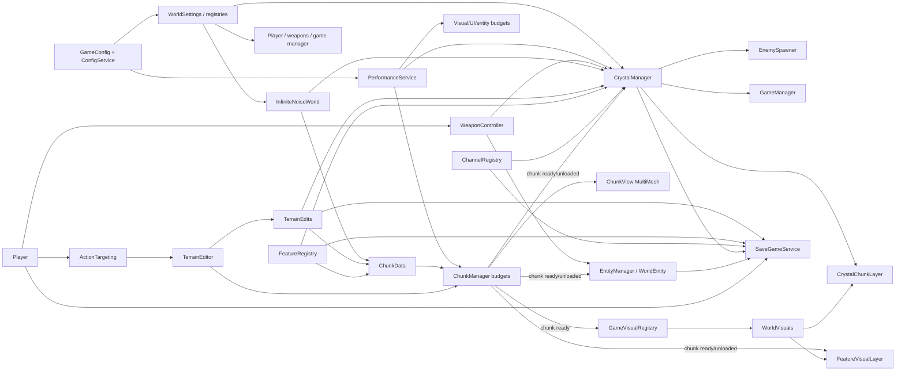

# Crystalstorm project graph

This document maps the repository as inspected on 2026-07-11. It records implemented runtime ownership and dependency direction; it does not infer intended features that are absent from the source. Paths below are repository-relative. `scenes/main.tscn` is the production scene.

## Scope and notation

- **Owns** means scene-tree parentage or runtime `add_child` ownership.
- **Uses** includes a direct reference, group lookup, preload, or shared registry.
- **Publishes** means a Godot signal or visible state consumed by another system.
- **Static registry** means a `RefCounted` class with static mutable state; it is process-global rather than scene-owned.

## Scenes and singletons

| Kind | Name | Owner / entry | Purpose |
|---|---|---|---|
| Production scene | `scenes/main.tscn` | `project.godot` `run/main_scene` | Full game runtime. |
| Runtime scene | `scenes/ChunkView.tscn` | Instantiated by `ChunkManager` | Chunk render container and terrain material binding. |
| Development scene | `scenes/world_viewer.tscn` | Manual/editor use | Fast 2D world-generation viewer. |
| UI subscene | `ui/game_overlay.tscn` | Instanced below main `CanvasLayer` | HUD, phase, run-state panel. |
| Editor dock scene | `addons/crystal_texture_tools/texture_gen_dock.tscn` | Editor plugin only | Texture generator UI. |
| Autoload singleton | `CrystalTextureGenerator` | `project.godot` | Runtime procedural texture/sprite generation. |
| Autoload singleton | `PerfProfiler` | `project.godot` | Frame/performance sampling. |
| Editor plugin | `crystal_texture_tools` | `project.godot` plugin list | Adds the texture-generation dock; not gameplay runtime. |

## Production scene ownership

```mermaid
flowchart TD
  Game[Game: main.gd]
  Game --> Config[ConfigService]
  Game --> Perf[PerformanceService]
  Game --> VisualRegistry[GameVisualRegistry]
  Game --> World[World: InfiniteNoiseWorld]
  Game --> VoxelWorld
  VoxelWorld -. runtime add_child .-> ChunkManager
  Game --> WorldVisuals
  WorldVisuals --> EntitiesLayer[Entities]
  WorldVisuals --> VegetationLayer[Vegetation]
  WorldVisuals --> BuildingsLayer[Buildings]
  WorldVisuals --> SpawnLayer[SpawnMarkers]
  WorldVisuals --> CombatLayer[CombatVFX]
  CombatLayer --> CombatVFX[CombatVisualFeedback]
  WorldVisuals --> FeatureVisuals[FeatureVisualLayer]
  Game --> Features[WorldFeatures]
  Features --> Towns[TownManager]
  Features --> Vegetation[VegetationManager]
  Features --> Growth[VegetationGrowthManager]
  Features --> TownDefense[TownDefenseManager]
  Features --> Ruins[RuinManager]
  Features --> Entities[EntityManager]
  Game --> Crystal[CrystalManager]
  Crystal --> EnemySpawner[CrystalEnemySpawner]
  Game --> GameManager
  Game --> TerrainEditor
  Game --> FluidService[VoxelFluidService]
  Game --> Save[SaveGameService]
  Game --> DevAssistant[DeveloperAssistant]
  Game --> DevTools[DevToolsCoordinator]
  Game --> Player
  Player --> Camera[Camera3D]
  Player --> Weapon[WeaponController: runtime child]
  Player --> Stats[StatComponent: runtime child]
  Player --> Highlight[TargetHighlight: runtime child]
  Game --> Canvas[CanvasLayer]
  Canvas --> Overlay[GameOverlay]
  Canvas --> Hotbar
  Canvas --> InventoryPanel
  Canvas --> Map[TopographicalMap]
  Canvas --> Debug[DebugPanel]
  Canvas --> DevChat[DevChatOverlay]
```



The three children marked “runtime child” are created/owned by `Player`; dynamic `WorldEntity`, `CrystalEnemy`, chunk views, crystal layers, feature visuals, and combat VFX are owned by their respective managers or visual layers.

## Initialization order

Scene child `_ready` ordering alone is insufficient because boot uses deferred work and readiness waits. The observed contract is:

```mermaid
sequenceDiagram
  participant A as Autoloads
  participant C as ConfigService
  participant P as PerformanceService
  participant V as GameVisualRegistry
  participant F as WorldFeatures
  participant W as VoxelWorld
  participant CM as ChunkManager
  participant X as Runtime dependents
  A->>A: CrystalTextureGenerator / PerfProfiler enter tree
  C->>C: Build GameConfig; apply WorldSettings; populate registries
  C->>P: Apply configured quality
  P->>P: Select env/default preset; deferred scene application
  V->>V: Generate/preload texture bundle; wait only for PerformanceService
  F->>F: Wait for ConfigService, applied performance, and texture readiness
  F->>F: Reset and seed feature/channel overlays (safe mode skips world content)
  W->>F: await ensure_ready()
  W->>CM: create and add ChunkManager
  CM->>CM: locate player/world; request streamed chunks
  W->>X: WorldFeatures.on_chunk_manager_ready(cm)
  X->>CM: bind terrain editor, entity manager, visuals, VFX; apply configs/preset
  CM-->>X: chunk_ready / chunk_unloaded
  X->>X: Crystal, UI, entities, visuals complete their polling/binding
```

Important nuance: `GameVisualRegistry.ensure_ready()` is deliberately texture-only during the feature bootstrap. It does **not** wait for `ChunkManager`; otherwise `WorldFeatures → VoxelWorld → ChunkManager` would deadlock. Full visual commit occurs after a chunk manager and initial chunks exist.

## Runtime systems and ownership

### Configuration, performance, and shared definitions

| System | Ownership | Uses / owns | Produces / affects |
|---|---|---|---|
| `ConfigService` | Main child; `config_service` group | `GameConfig`; all content registries; world, crystal, game, terrain, town, vegetation, performance services | Applies active world settings/configuration and registers definitions. |
| `PerformanceService` | Main child; `performance_service` group | `PerformanceQualityConfig`; group-discovered runtime systems; `/root/PerfProfiler` | Applies LOW/MEDIUM/HIGH/SAFE budgets to chunks, world caves, crystal, map, debug, visual, growth, entity systems. |
| `GameConfig` and `config/*.gd` resources | Data objects, not scene nodes | World, crystal, combat, save, map, performance, content definitions | Default/configured values. |
| `WorldSettings` | Static active resource | Used broadly by terrain, player, visual conversion, ramps | Global coordinate/height/scale policy. |
| `BuildingRegistry`, `PlantableRegistry`, `EntityBrainRegistry`, `EnemySpawnRegistry`, `SpawnPointRegistry`, `RelicRegistry`, `FluidRegistry` | Static registry classes | Built-ins plus config overrides | Shared content definition lookup. |
| `ItemTypes`, `VoxelTypes`, `CrystalTypes`, `WorldFeatureTypes`, `StatIds`, `WorldBorder`, `TerrainRamps`, `VoxelGeometryKind`, `VoxelPrimitiveMeshes`, `WorldVisualCoords`, `VoxelPropBuilder`, `ScenarioPresets` | Static helper classes | Some read active settings/registries | Constants, conversion, geometry, factories, and tool scenarios. |

### World, terrain, and streaming

| System | Ownership | Dependencies | Runtime responsibility |
|---|---|---|---|
| `InfiniteNoiseWorld` | Main `World`; `world` group | `WorldSettings`, `WorldGenConfig`, `BiomeLayout`, `TerrainEdits`, `FeatureRegistry`, noise | Deterministic height, tile, biome, river, cave, and border queries with caches/worker-safe alternatives. |
| `WorldFeatures` | Main child; `world_features` group | Config, performance, visual texture readiness, `World`; owns child managers | Resets and seeds feature/channel overlay registries before chunk creation. |
| `TownManager`, `VegetationManager`, `RuinManager` | Children of `WorldFeatures` | World, registries/config | Deterministically place towns, vegetation, ruins. |
| `VegetationGrowthManager` | Child of `WorldFeatures`; group | Feature/channel/plant registries, crystal config | Advances plant growth and emits `growth_stage_changed`. |
| `TownDefenseManager` | Child of `WorldFeatures`; group | Feature registry, crystal, entity manager | Tracks town state/health; requests militia. |
| `TerrainEdits`, `FeatureRegistry`, `ChannelRegistry` | Static mutable overlays | Save codec, definitions; queried by world/chunks/crystal/map | Canonical runtime overlays for edits, features, channels. |
| `TerrainEditor` | Main child; `terrain_editor` group | Player/action targeting, inventory, chunk manager, crystal config, terrain overlay | Handles dig/build/plant interaction and requests affected chunk rebuilds. |
| `VoxelWorld` | Main child | Waits `WorldFeatures`; owns `ChunkManager` dynamically | Lifecycle bridge that creates the streaming manager only after feature seeding. |
| `ChunkManager` | Child created by `VoxelWorld`; `chunk_manager` group | Player, world, `ChunkData`, ramps, chunk scene, performance/world-gen config | Worker-thread generation, stream radius, mesh production/upload, rebuilds, chunk lifecycle signals. |
| `ChunkData` | Per generation job/view | World and snapshotted overlays | 16×16 surface/tile/ramp/geometry data; no persistent full 3D voxel grid. |
| `ChunkMeshBufferBuilder` / `ChunkView` | Builder utility / per-chunk node | Mesh data, atlas shader, ramp meshes | Convert quads to grouped MultiMesh buffers and render them. |

### Crystal, fluids, game state, entities, and player

| System | Ownership | Dependencies | Runtime responsibility |
|---|---|---|---|
| `CrystalManager` | Main child; `crystal_manager` group | World, chunks, terrain/features/channels, config/perf, visual registry, player, terrain/growth managers | Owns crystal simulation, chunk layers, absorption/evolution, spawn points/markers, dirty visual rebuilds, crystal signals/state import/export. |
| `CrystalFluidSim` | Owned by crystal manager; subclass of `VoxelFluidEngine` | `CrystalTerrainQuery`, crystal config, fluid registry | Pressure-pool depths/frontier and depth change signals. |
| `CrystalTerrainQuery` | Owned/configured by crystal manager | World, chunks, terrain/feature/channel/building/plant registries | Terrain, water/channel, feature, and flow-cost queries. |
| `CrystalEvolution` / `SpawnPointController` | Owned by crystal manager | Unlock/spawn definitions and combat log | Absorption unlock state; spawn damage/destruction and boss gate. |
| `CrystalChunkLayer` / `CrystalSpawnPoint` / `CrystalCell` | Dynamic visual/data objects | Crystal mesh/settings/spawn defs | Per-chunk crystal visual, spawn model, cell record. |
| `VoxelFluidService` | Main child; `voxel_fluid_service` group | Channel registry, generic fluid engine, world/player/terrain targeting | Player-created water-channel simulation and persistence state. |
| `GameManager` | Main child; `game_manager` group | Player, crystal, world, town defense, config | Maintains maze/assault phase and playing/victory/defeat state. |
| `EntityManager` | `WorldFeatures` child; `entity_manager` group | Feature spawn data, world/chunks, visual roots, navigation, config/perf | Spawns/despawns animals and militia around streamed chunks; owns world entities. |
| `WorldEntity` / `EntityBrain` / `EntityNavigation` | Dynamic entity / utility | World, chunks, crystal/player, stats/visual registry | AI, voxel-aware navigation, collision, health/death signal, visual refresh. |
| `CrystalEnemySpawner` | Child of crystal manager; group | Crystal/evolution, player, world/chunks, config | Unlock-aware hostile spawning and owns crystal enemies. |
| `CrystalEnemy` | Dynamic spawner child; `crystal_enemy` group | Navigation, player/crystal, visual registry | Movement, contact/detonation, health and combat signal behavior. |
| `Player` | Main child; `player` group | World/chunks/crystal, floor probe, inventory/stats/weapons/camera | Custom voxel-aware movement, input, health, save state; dynamically owns controller/support nodes. |
| `Camera3D`, `VoxelFloorProbe`, `ActionTargeting`, `TargetHighlight` | Player child / utilities | Player/world/chunks/terrain edits | Orthographic camera, walkability/collision, ray/column action resolution, target indication. |
| `Inventory`, `StatSheet`, `StatComponent`, `StatModifier`, `WeaponController`, `CombatHitResolver`, `CombatLog` | Player-owned or utility | Item/stat/combat defs; player/world/crystal/entities/terrain | Item state, modifiers, attacks/dig actions, hit queries, combat diagnostics. |
| `RelicManager` | Script exists but is not a node in `main.tscn` | Player/stats/config/relic registry when instantiated | Relic application manager; runtime integration is conditional/not scene-owned. |

### Visuals, UI, save, and developer tools

| System | Ownership | Dependencies | Runtime responsibility |
|---|---|---|---|
| `GameVisualRegistry` | Main child; group | `CrystalTextureGenerator`, performance, chunk lifecycle, world visual systems | Texture cache/generation, visual flags, post-bootstrap refresh. |
| `WorldVisuals` | Main child; `world_visuals_root` group | WorldFeatures, chunks, visual registry | Owns visual-layer roots and coordinates first visual population. |
| `FeatureVisualLayer` | `WorldVisuals` child; group | Feature/growth registries, chunks, visual registry | Per-chunk vegetation/building feature visuals. |
| `CombatVisualFeedback` | `WorldVisuals/CombatVFX`; group | Weapon, entity manager, crystal, game manager, visual registry | Damage labels, bursts, spawn/boss feedback. |
| `CrystalTextureGenerator` | Autoload | Texture config/palette | Procedural textures for entities, vegetation, buildings, particles, terrain-related assets. |
| `TopographicalMap` / `TopographicalMapBuilder` | Canvas child / utility | World, crystal, features, channels, performance/map config | Incremental terrain map and crystal/marker overlay. |
| `GameOverlay`, `Hotbar`, `InventoryPanel`, `DebugPanel`, `DevChatOverlay` | Canvas children | Player/inventory, game/crystal state, profiler, developer assistant | Presentation and local controls. |
| `SaveGameService`, `SaveCodec`, `ConfigJsonIO` | Main child/group and utilities | All major overlays/managers/player/entities | Snapshot/restore of runtime state; quick-save/load input. |
| `DeveloperAssistant` / `DevToolsCoordinator` / `BugReporter` | Main children/groups and utility | UI, scenarios, perf/debug/game tree | Local slash commands, JSONL external-assistant bridge, debug toggle, bug-report bundle. |

### Complete supporting-type inventory

The tables above describe ownership. The following non-manager types complete the runtime source inventory and should be treated as dependencies rather than independent scene systems:

| Area | Types / files | Role in graph |
|---|---|---|
| Config resources | `AbsorptionUnlockDef`, `BuildableDef`, `CombatDef`, `CrystalSimConfig`, `CrystalTextureGenConfig`, `CrystalTexturePalette`, `EnemySpawnDef`, `EntityBrainConfig`, `FluidTypeDef`, `GameConfig`, `PerformanceQualityConfig`, `PlantableDef`, `RelicDef`, `SaveGameConfig`, `SpawnPointDef`, `TopographicalMapConfig`, `WorldGenConfig`, `WorldSettings` | Typed configuration and definition data supplied through `ConfigService`/registries. |
| Crystal data | `CrystalCell`, `CrystalSpawnPoint` | Per-cell and per-spawn data owned by crystal orchestration. |
| Entity and stat data | `EntityBrain`, `Inventory`, `StatSheet`, `StatModifier`, `StatComponent`, `StatIds` | Entity behavior and player/entity item/stat state. |
| Fluid and persistence utilities | `VoxelFluidEngine`, `SaveCodec`, `ConfigJsonIO`, `TexturePaletteJsonIO` | Shared simulation base and JSON-safe config/save serialization. |
| Terrain/visual helpers | `BiomeLayout`, `ChunkMeshBufferBuilder`, `ChunkData`, `ChunkView`, `CrystalClusterMesh`, `TerrainRamps`, `VoxelGeometryKind`, `VoxelPrimitiveMeshes`, `VoxelPropBuilder`, `WorldVisualCoords` | Generation layout, mesh/geometry construction, and world-to-visual conversion. |
| Static rules and registries | `BuildingRegistry`, `ChannelRegistry`, `EnemySpawnRegistry`, `EntityBrainRegistry`, `FeatureRegistry`, `FluidRegistry`, `PlantableRegistry`, `RelicRegistry`, `SpawnPointRegistry`, `TerrainEdits`; `CrystalTypes`, `ItemTypes`, `VoxelTypes`, `WorldBorder`, `WorldFeatureTypes` | Process-global game definitions or mutable overlays. `TerrainEdits`, `FeatureRegistry`, and `ChannelRegistry` are the mutable canonical overlays. |
| Input, combat, maps, diagnostics | `GameplayInput`, `ActionTargeting`, `VoxelFloorProbe`, `TargetHighlight`, `CombatHitResolver`, `CombatLog`, `TopographicalMapBuilder`, `PerfProfiler`, `BugReporter`, `ScenarioPresets` | Input gating/targeting, collision, combat resolution/logging, incremental map work, diagnostics and dev scenarios. |

## Communication graph

### Primary data flows



### Signal topology

| Publisher | Signal | Consumers / effect |
|---|---|---|
| `ChunkManager` | `chunk_ready`, `chunk_unloaded` | Crystal manager, entity manager, feature visual layer, world visuals, game visual registry; drives streaming state and visuals. |
| `CrystalFluidSim` | `depth_changed`, `depth_cleared` | Crystal manager updates cells/chunk dirty state. |
| `CrystalManager` | `fluid_changed`, `power_changed`, spawn signals, player-touch, absorption complete | Game manager, HUD, combat VFX, save hooks, spawn/gameplay systems. |
| `SpawnPointController` | spawn damage/destroy/all-destroyed | Crystal manager, then game manager/VFX/HUD through crystal signals. |
| `GameManager` | `phase_changed`, `run_state_changed` | Game overlay and combat visual feedback. |
| `EntityManager` / `WorldEntity` | spawn/despawn; `died`/combat signals | Combat visual feedback, entity cleanup, weapon response. |
| `Inventory` | `changed`, `hotbar_changed` | Hotbar and inventory panel. |
| `VegetationGrowthManager` | `growth_stage_changed` | Feature visual layer. |
| `GameVisualRegistry` | `visuals_ready`, `post_bootstrap_refreshed` | World visuals and entity/enemy visual refresh. |
| `DeveloperAssistant` | `response_ready` | Dev chat overlay. |

## Data-flow narratives

### Terrain edit to rendered/gameplay result

1. Player input selects an item; `ActionTargeting` resolves a mouse/forward terrain column.
2. `WeaponController` (dig) or `TerrainEditor` (build/interact/plant) updates `TerrainEdits` and, as applicable, feature/channel registries and inventory.
3. `TerrainEditor` asks `ChunkManager` to rebuild the affected chunk(s). Before worker generation, `ChunkData.capture_worker_snapshot()` copies relevant overlay state.
4. Worker generation queries `InfiniteNoiseWorld` through worker-safe height/tile APIs, builds surface maps, and returns mesh data. The main thread uploads `ChunkView` MultiMeshes under its budget.
5. Player floor probing, targeting, crystal terrain query, entities, feature visuals, and map subsequently read the same overlays/world queries. A save captures overlays rather than serializing chunk views.

### Crystal simulation to pressure/combat result

1. `CrystalManager` configures `CrystalTerrainQuery`, `CrystalFluidSim`, evolution, and spawn controller from config and registries.
2. Each simulation tick uses terrain height, terrain edits, water/channels, buildings, vegetation, and loaded-chunk constraints to distribute crystal depth.
3. Fluid depth signals mark crystal cells/chunks dirty. `CrystalManager` updates `CrystalChunkLayer` meshes and spawn markers beneath `WorldVisuals`.
4. Absorption updates evolution/unlocks, which feed the enemy spawner. Nearby crystal can alter player floor height and trigger game-state pressure; spawn damage/destruction can lead to victory gate evaluation.
5. Map UI, HUD, VFX, save service, town defense, entity logic, and player collision observe crystal state through manager APIs/signals.

### Save/load flow

`SaveGameService` waits for world-feature and crystal bootstrap, serializes seed/config plus terrain edits, channels, feature overlay, crystal, game/town/player/entity/enemy state, then writes JSON. Load restores overlays first, invalidates world caches and rebuilds chunks, then restores crystal, game, town, player, entities/enemies, and refreshes visuals. This ordering prevents restored entities/crystal from binding to stale terrain views.

## Architectural findings

### Circular dependencies and boot-cycle risks

There is no obvious direct static-preload cycle requiring a code change, but runtime cycles exist:

| Cycle / risk | Current mitigation | Why it remains important |
|---|---|---|
| `WorldFeatures → GameVisualRegistry → ChunkManager` while `VoxelWorld` waits for `WorldFeatures` before creating `ChunkManager` | `ensure_textures_ready()` waits only for texture initialization; it intentionally does not wait for chunk creation. | Calling a future “fully ready” visual wait inside feature bootstrap can reintroduce a deadlock. |
| `WorldVisuals → WorldFeatures → ChunkManager → GameVisualRegistry → WorldVisuals` | Deferred bootstrap and post-bootstrap refresh; visual registry waits for initial chunks only after they exist. | Several systems call refresh/poll by groups, so readiness semantics must stay precise. |
| `ConfigService ↔ PerformanceService` | Config pushes configured quality; performance later reads config world-gen state while applying cave/vegetation policy. | Reentrant config/preset changes can produce partially applied state if not deferred/ordered. |
| `CrystalManager ↔ TerrainEditor / VegetationGrowthManager / ChunkManager` | Lazy group binding, chunk callbacks, config application, dirty queues. | Terrain changes affect flow; crystal affects walkability and plant absorption; changing either path requires regression coverage across all three. |
| `GameVisualRegistry ↔ dynamic entities/enemies/feature visuals` | Registry broadcasts `visuals_ready`; dynamic nodes defer/one-shot refresh. | Visual fallback creation and repeat refresh must not leak duplicate nodes or connect repeatedly. |

### God Objects / high-centrality services

These are not necessarily defects, but they are high-risk change points:

| Object | Why it is high-centrality | Primary risk |
|---|---|---|
| `CrystalManager` | Simulation, flow state, rendering layers, spawn points, evolution, absorption, terrain reactions, persistence, player contact, and visual marker management. | Gameplay, rendering, and persistence concerns converge; regression radius is large. |
| `ChunkManager` | Streaming, worker jobs, meshing, ramps, rebuild scheduling, upload budgets, lifecycle signals, and collision-facing chunk queries. | Main-thread performance and terrain correctness converge; worker/main ownership is delicate. |
| `ConfigService` | Constructs defaults, registers content, applies settings to many systems, imports/exports configuration. | Order-dependent group lookups can silently skip systems not ready yet. |
| `PerformanceService` | Mutates policy across chunks, world generation, crystal, maps, debug, visuals, growth, entities, profiler. | A preset change can alter many subsystems without a single typed contract. |
| `GameVisualRegistry` | Texture generation/cache, performance flags, chunk lifecycle, refreshes all dynamic visual consumers. | Visual updates are broad, asynchronous, and group-coupled. |
| Static overlays (`TerrainEdits`, `FeatureRegistry`, `ChannelRegistry`) | Canonical mutable state read by generation, crystal, map, save, features, and interactions. | Global state complicates test isolation, save/load, worker snapshots, and future multiple-world support. |

### Architectural bottlenecks

| Bottleneck | Evidence | Practical implication |
|---|---|---|
| Chunk generation/upload | Worker queues plus main-thread mesh buffer upload and rebuild throttles. | Terrain edits, streaming distance, and visual density contend for frame time. |
| Group lookup coupling | Frequent `get_first_node_in_group` calls, especially for world/player/chunks/crystal/visual registry. | Ordering and replacement assumptions are implicit; tests need complete group setup. |
| Global overlay snapshots | `ChunkData` snapshots terrain/feature state before worker work. | Correctness depends on explicit invalidation/rebuild after mutations; snapshots are necessarily stale during a running job. |
| Crystal visual rebuilds | Dirty cells/chunks, depth thresholds, loaded-chunk limits, per-frame rebuild cap. | Smoothness, visual continuity, and performance trade against one another. |
| Feature seeding | WorldFeatures awaits config/performance/textures and can scatter significant content before chunks. | Boot latency and safe-mode behavior are centralized here. |
| Visual refresh fan-out | Registry refreshes entities, enemies, spawn markers, feature layer, combat VFX. | A texture/performance refresh can be expensive and must remain idempotent. |
| Save/load rehydration | Overlay restore → cache invalidation → chunk rebuild → crystal/entity restoration. | Ordering is essential; partial load failure can leave mixed state. |

## Repository-only systems

The runtime graph excludes these from production ownership but they are part of the repository:

- `scripts/`: headless verification, smoke/display probes, maintenance wrappers, visual regeneration, river checking, and backlog triage. `scripts/run_all_verify.sh` is the full verification manifest.
- `archive/legacy/`: retired prototype material; it must not be referenced by production scenes.
- `addons/crystal_texture_tools/`: editor-only texture generation plugin and dock.
- `prompts/`: original/design discussion source material; not loaded by game code.
- `assets/`, `shaders/`, `.tres` resources: rendering/source assets consumed by scenes, shader materials, and texture systems.

## Change guidance derived from the graph

1. Do not add a wait for chunk readiness to the texture-only visual bootstrap path.
2. Treat terrain mutations as overlay mutation plus world-cache invalidation/rebuild work, never as a direct chunk-view edit.
3. When changing crystal, test simulation, chunk rendering, player floor interaction, enemy spawning, map, saves, and town/vegetation interactions.
4. When changing config or presets, test startup ordering and every consumer that PerformanceService mutates.
5. Prefer explicit interfaces/signals for new cross-system communication; do not expand group lookup or static registry reach without documenting the new contract.
