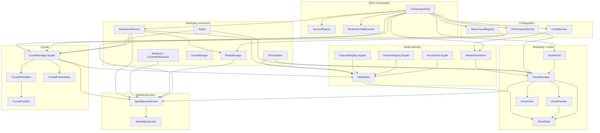
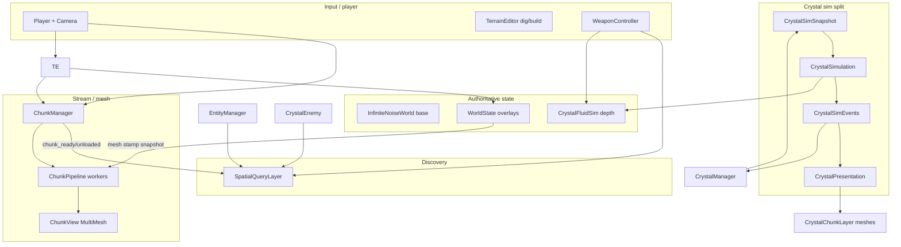
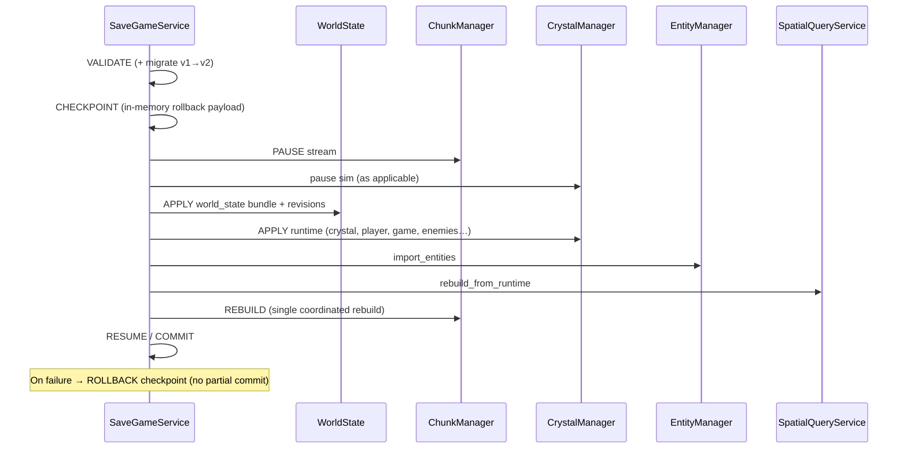
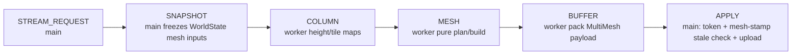
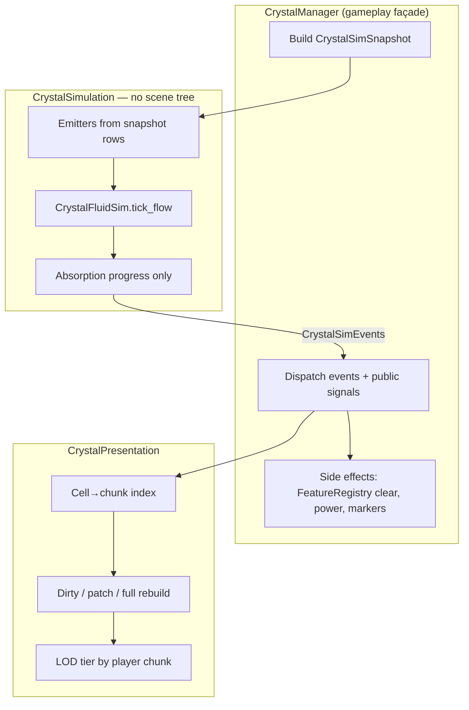
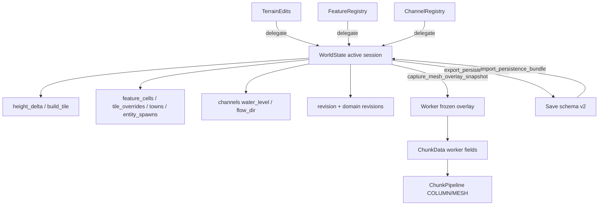
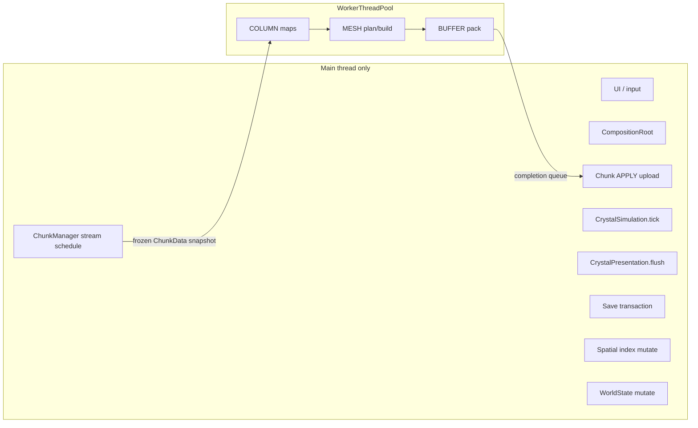

# Crystal Storm Engine 1.0 — Architecture Reference

**Status:** Authoritative engine documentation for future development  
**Platform:** Godot 4.6+ (Forward+, Jolt Physics)  
**Production scene:** `scenes/main.tscn` (`main.gd` + `CompositionRoot`)  
**Companion conventions:** `AGENTS.md` (mandatory coding / non-regression rules)

This document validates and freezes the Engine 1.0 architecture after:

| Milestone | Authority |
|---|---|
| WorldState | Session overlay ownership + domain revisions |
| Chunk Pipeline | Staged, snapshot-fed worker mesh jobs |
| Transactional Save | Schema v2 + checkpoint/rollback load |
| Composition Root | Single boot/wiring root + ServiceRegistry |
| Spatial Query Layer | Discovery index (not gameplay) |
| Crystal Simulation Split | Snapshot-in / event-out sim + presentation |

**Do not redesign these systems without an explicit architecture RFC.**  
Game design docs live under `studio/design/`; this file is **engine runtime** only.

---

## 1. Subsystem dependency graph

High-level production dependencies (edges mean “uses / is wired after”):



### Dependency rules (hard)

| Rule | Meaning |
|---|---|
| **WorldState is sole overlay write authority** | No new process-global mutation maps |
| **Workers never read live WorldState** | Only frozen `ChunkData` worker snapshots |
| **CompositionRoot owns production boot wiring** | Groups are UI/debug adapters, not boot authority |
| **SpatialQueryLayer owns discovery** | Not combat damage, AI policy, or growth rules |
| **CrystalSimulation owns pure fluid/progress** | No scene tree; presentation schedules mesh only |

---

## 2. Startup graph

### 2.1 Boot ownership

```
main.gd _ready
    └── await CompositionRoot.boot_async()
```

Stages are **one-way** (`systems/composition_root.gd`):

```mermaid
stateDiagram-v2
  [*] --> UNINITIALIZED
  UNINITIALIZED --> CONFIGURED: register scene services; ConfigService.apply_to_registered
  CONFIGURED --> QUALITY_APPLIED: resolve EffectiveRuntimePolicy; Perf/Config registry apply
  QUALITY_APPLIED --> FEATURES_SEEDED: textures ready; WorldFeatures.bootstrap_with_services
  FEATURES_SEEDED --> CHUNKS_CREATED: VoxelWorld.create_chunk_manager_with_services; explicit handoff
  CHUNKS_CREATED --> INITIAL_STREAM_READY: ≥1 chunk resident
  INITIAL_STREAM_READY --> VISUALS_COMMITTED: WorldVisuals post-bootstrap refresh
  VISUALS_COMMITTED --> RUNNING
  RUNNING --> SHUTTING_DOWN: reverse registry shutdown_order
  CONFIGURED --> FAILED
  QUALITY_APPLIED --> FAILED
  FEATURES_SEEDED --> FAILED
  CHUNKS_CREATED --> FAILED
```



### 2.2 Configuration precedence (resolved once per boot apply)

```
author defaults
  → project / authored GameConfig
  → quality preset (PerformanceQualityConfig)
  → platform overrides (Dictionary)
  → runtime debug overrides (Dictionary)   ← wins
```

Implementation: `RuntimeConfigResolver.resolve` + `fold_policy_into_quality`.  
**Quality must not mutate authored `WorldGenConfig` sim authority fields** (e.g. do not rewrite resource `caves_enabled` permanently).

### 2.3 Service registration (Composition Root)

Registered by path (not group search) at boot, including:

| ID | Node / dynamic |
|---|---|
| `config_service` | ConfigService |
| `performance_service` | PerformanceService |
| `game_visual_registry` | GameVisualRegistry |
| `spatial_query_service` | SpatialQueryService |
| `world` | InfiniteNoiseWorld |
| `world_features` | WorldFeatures |
| `voxel_world` | VoxelWorld |
| `chunk_manager` | created dynamically |
| `crystal_manager` | CrystalManager |
| `save_game_service` | SaveGameService |
| `entity_manager` | under WorldFeatures |
| … | terrain, player, visuals, combat VFX, game_manager |

Diagnostics: `CompositionRoot.get_diagnostics()` / `get_health_report()`; `ServiceRegistry.validate_dependencies()` / `detect_cycles()`.

### 2.4 Critical boot contracts

1. **Textures before chunks** — `GameVisualRegistry.ensure_textures_ready()` is awaited in FEATURES; must not wait on chunks (historical deadlock break).
2. **Features before ChunkManager** — seeding completes before stream jobs see feature overlays.
3. **Explicit chunk handoff** — `_on_chunk_manager_ready_explicit` binds config, terrain, spatial, entity, visuals, combat, perf; not group-authority fan-out.
4. **Policy to consumers** — `PerformanceService.apply_to_registered(registry, resolved)` folds platform/debug into effective quality.

---

## 3. Runtime graph

Frame-oriented data flow after `RUNNING`:



### Runtime ownership summary

| Concern | Owner | Not owner |
|---|---|---|
| Base terrain (seed) | `InfiniteNoiseWorld` | Mesh / ChunkView |
| Player edits / features / channels | `WorldState` (+ façades) | Static registries as storage |
| Loaded chunk views | `ChunkManager` | Crystal / entities (consumers) |
| Crystal depth field | `CrystalFluidSim` via `CrystalSimulation` | Presentation meshes |
| Spatial object index | `SpatialQueryLayer` | Combat formulas |
| Save transaction | `SaveGameService` | Ad-hoc file writers |

---

## 4. Save pipeline

**Schema:** v2 (`systems/save_schema.gd`), format id `crystalstorm_save`.  
**Integrity:** order-independent canonical JSON hash (`SaveSchema.content_hash`).

### 4.1 Load transaction stages



### 4.2 Persistence boundaries

| Data | Authority |
|---|---|
| Terrain height/build, features, channels | `WorldState.export/import_persistence_bundle` |
| Crystal depth/spawns/power/evolution | `CrystalManager.export_state` / `import_state` |
| Entities / enemies | EntityManager / CrystalEnemySpawner |
| Player / game phase | Player / GameManager |

**Do not** re-scatter overlay serialization into static registry JSON maps.

---

## 5. Chunk pipeline

Defined in `chunks/chunk_pipeline.gd`:



### 5.1 Invariants

| Invariant | Detail |
|---|---|
| Worker entry | `ChunkPipeline.run_worker_job` — **stateless** w.r.t. manager scratch |
| Overlay freeze | `ChunkData.capture_worker_snapshot()` stamped with `mesh_input_revision` |
| Stale rejection | `ChunkManager.is_mesh_job_stale` — gen token **or** superseded mesh stamp |
| Greedy scratch | Job-local `alloc_greedy_visited`; micro skip on job `ChunkData` |
| Upload | Main-thread throttled (budget / max chunks per frame) |

### 5.2 Lifecycle signals

- `ChunkManager.chunk_ready(coord, data)`
- `ChunkManager.chunk_unloaded(coord)`

Consumers: EntityManager, SpatialQueryService, CrystalManager, feature visuals, combat VFX.

### 5.3 Chunk geometry constants

- `ChunkData.SIZE = 16`, `HEIGHT = 160`
- Default stream: `RENDER_DISTANCE` inspector / quality policy (default often 3)
- Mesh style: heightfield surface + Y-greedy + side RLE; BOTTOM faces disabled

---

## 6. Simulation pipeline (Crystal)



### 6.1 Snapshot inputs (examples)

- `delta`, `flow_substeps`, `global_flow_mult`, `emit_weaken_mult`
- Spawn emitter rows (or live spawn objects passed as data)
- `loaded_chunks` set (sim may limit to loaded chunks)
- `CrystalTerrainQuery` (world bound by façade; sim never calls `get_tree()`)
- Feature lookup Callable, ruin centers list
- Optional `spatial_query` handle (read-only discovery)

### 6.2 Event kinds (`CrystalSimEvents`)

| Kind | Consumer |
|---|---|
| `DEPTH_CHANGED` / `DEPTH_CLEARED` | Presentation + `fluid_changed` signal |
| `FLOW_BATCH` | Presentation mesh dirty set (not per-cell `fluid_changed` spam) |
| `STATS` | volume / covered_cells |
| `ABSORPTION_READY` / `RUIN_ABSORPTION_READY` | Façade applies feature clears + power |
| `POWER_DELTA` | Façade power |

### 6.3 Pause / resume

- `expansion_enabled` / quality `crystal_sim_enabled` gates façade ticks.
- Without ticks, pure sim state is frozen (no hidden background crystal job).

---

## 7. Spatial query consumers

**Owner:** `SpatialQueryLayer` (pure index) + `SpatialQueryService` (lifecycle).

### 7.1 Categories (bit flags)

`terrain | crystal | fluid | entity | structure | town | projectile | ai`

### 7.2 Query API surface

| API | Use |
|---|---|
| `query_radius` / `query_aabb` / `query_nearest` / `query_ray` | Object discovery |
| `iter_region` / `iter_chunk_neighborhood` / `iter_category` | Iteration |
| `query_combat_candidates` | Entity ∪ AI near origin |
| `insert` / `remove` / `move` | Incremental index updates |

Steady-state queries use a **uniform grid** (default cell size 8); intentional `query_radius_linear_scan` exists only for perf baselines.

### 7.3 Production consumers

| Consumer | Path |
|---|---|
| `CombatHitResolver` | Melee/ranged candidates via `query_combat_candidates` when combatants indexed |
| `ActionTargeting` | Entity-near-column checks |
| Entity / CrystalEnemy | Register after final position; `notify_moved` on step |
| Chunk stream | Terrain markers + static features on load; unload clears statics |
| Save restore | `SpatialQueryService.rebuild_from_runtime()` |
| Crystal snapshot | Optional spatial handle on `CrystalSimSnapshot` |

**Not spatial discovery:** voxel dig/build rays, floor probe, pure height queries — remain ChunkManager / world geometry APIs.

---

## 8. WorldState ownership graph



### Domains

| Domain | Affects mesh workers? |
|---|---|
| `DOMAIN_TERRAIN` | Yes (`DOMAIN_MESH_INPUT`) |
| `DOMAIN_FEATURE_TILE` | Yes |
| `DOMAIN_FEATURE` (meta) | No forced mesh invalidation |
| `DOMAIN_CHANNEL` | Sim/query; not heightfield mesh |

`mesh_input_revision()` = combined terrain + feature_tile stamp for stale mesh rejection.

### Session lifecycle

- `WorldState.get_active()` / `set_active` / `replace_active`
- Batches: `begin_batch` / `end_batch` coalesce `changed` emissions
- Façades must not reintroduce independent static storage

---

## 9. Thread boundaries



| May run off main | Must stay main |
|---|---|
| Chunk column + mesh + buffer stages | Scene tree edits, MultiMesh apply |
| Pure math on frozen dictionaries | WorldState live maps |
| Job-local greedy/micro scratch | SpatialQuery insert/move |
| | CrystalPresentation mesh nodes |
| | Save file IO orchestration + checkpoint |

**Synchronization tools:** generation tokens, mesh_input_revision stamps, `stream_paused`, process-frame rebuild flush (avoid deferred flood).

---

## 10. Synchronization points

| Point | Mechanism |
|---|---|
| Boot readiness | Composition stages + timeouts + diagnostics dump |
| Feature seed complete | `WorldFeatures.bootstrap_complete` |
| Chunk job identity | Per-coord gen token; cancel on unload/supersede |
| Mesh freshness | Worker snapshot stamp vs current `mesh_input_revision` |
| Stream freeze (save) | `ChunkManager.stream_paused` |
| Crystal tick | Façade `_sim_accum` + `crystal_sim_hz` / skip frames |
| Visual textures | `GameVisualRegistry` readiness before feature seed |
| Service DI | ServiceRegistry resolve/require; reverse shutdown order |

---

## 11. Deterministic replay guarantees

| Layer | Guarantee | Requirements |
|---|---|---|
| Base terrain | Deterministic given `world_seed` + gen config | Same FastNoiseLite params / biome rules |
| Overlays | Identical after `WorldState` import of same bundle | Schema v2 + revisions |
| Crystal fluid | Deterministic for fixed snapshot series | Same config, emitters, loaded-chunk mask, terrain heights |
| Chunk mesh | Deterministic from frozen column maps | Same stamp + algorithm; ignore GPU timing |
| Save integrity | Canonical key-sorted hash | `SaveSchema.content_hash` |
| Spatial order | Stable ties | distance → `stable_key` → id |

**Not guaranteed identical without control:** wall-clock FPS, MultiMesh upload frame split, WorkerThreadPool completion order (apply still rejects stale jobs), floating UI layout.

**Replay recipe (engine):**

1. Fixed seed + quality/debug policy  
2. Apply same WorldState overlay payload  
3. Same crystal `export_state` / import  
4. Drive crystal via identical `CrystalSimSnapshot` ticks (headless)  

---

## 12. Extension points

| Need | Extend here | Avoid |
|---|---|---|
| New boot service | Register on CompositionRoot + ServiceRegistry | Group polling as authority |
| New overlay domain | WorldState domain + façade | New static Dictionary storage |
| New mesh stage data | ChunkPipeline stage + job-local scratch | Shared manager visit buffers |
| New combatant type | Spatial category + register after final transform | Linear group scan as primary discovery |
| New crystal behavior | CrystalSimulation events + façade side effects | Scene access inside simulation |
| New save blob | Save schema version + migrate path | Silent key drops on load |
| Quality knobs | PerformanceQualityConfig + `fold_policy_into_quality` | Mutating authored WorldGen resources |
| Headless proof | `scripts/verify_*.gd` + `run_all_verify.sh` | Manual-only gates for engine contracts |

---

## 13. Known technical debt

Documented residual debt (acceptable under Engine 1.0 constraints; track before major rewrites):

1. **UI/debug group discovery** — debug panel, hotbar, map still use groups as discovery adapters.  
2. **PerformanceService `_apply_to_scene`** — legacy group path for non-composition; production re-applies via registry.  
3. **Plant absorption feature reads** — façade Callables into FeatureRegistry; not a frozen full-feature WorldState snapshot.  
4. **Crystal façade leftovers** — unused pre-split absorption helpers may remain; hot path is simulation events.  
5. **Spatial categories** — fluid/projectile lifecycle hooks are API-ready; not every system fully indexes them.  
6. **Stream readiness waits** — process frames for “chunks exist” (data async), not peer discovery polling.  
7. **Headless teardown freelist noise** — known Godot/chunk worker abort after OK markers in some probes.  
8. **studio/ENGINE_ARCHITECTURE.md** — partially pre-WorldState wording; **prefer this ENGINE_REFERENCE.md**.

---

## 14. Performance characteristics

| Area | Characteristics |
|---|---|
| Terrain mesh | Heightfield + Y-greedy + side RLE; no BOTTOM faces |
| Stream | `RENDER_DISTANCE` / quality; throttled load/unload per frame |
| Mesh upload | µs budget + max chunks/frame; deferred flush without message-queue flood |
| Crystal fluid | Cell caps, new-cell caps, spread damping, mesh depth epsilon |
| Crystal mesh | Rebuild budget + µs budget; patch path when possible |
| Spatial | Grid cells visited ≪ N (verified with linear-scan baseline) |
| Quality presets | `CRYSTALSTORM_PERF_PRESET=low\|medium\|high\|safe`, `CRYSTALSTORM_SAFE_MODE=1` |
| Profiling | Autoload `PerfProfiler`; gauges for crystal cells / changed |

**Policy knobs** live on EffectiveRuntimePolicy (render distance, inflight, caves enablement, crystal caps, profiler, vegetation scatter mult, etc.) — not as ad-hoc env reads inside systems.

---

## 15. Public APIs (engine surface)

### 15.1 Composition / config

| Type | Entry points |
|---|---|
| `CompositionRoot` | `boot_async`, `shutdown`, `set_debug_overrides`, `get_diagnostics`, `get_health_report`, `registry` |
| `ServiceRegistry` | `register`, `resolve`, `require`, `validate_dependencies`, `detect_cycles`, `shutdown_order` |
| `RuntimeConfigResolver` | `resolve`, `fold_policy_into_quality`, `policy_get` |
| `ConfigService` | `apply_to_registered`, `game_config`, registries bootstrap |
| `PerformanceService` | `apply_to_registered`, `reapply_to_chunk_manager`, `quality` / `effective_quality` |

### 15.2 World / voxels

| Type | Entry points |
|---|---|
| `WorldState` | `get_active`, domain revs, batch, snapshots, persistence export/import |
| `TerrainEdits` / `FeatureRegistry` / `ChannelRegistry` | Façade mutators/queries → WorldState |
| `InfiniteNoiseWorld` | height/tile/biome queries; seed |
| `ChunkManager` | stream, rebuild, `chunk_ready`/`chunk_unloaded`, cell loaded queries |
| `ChunkPipeline` | `run_worker_job`, stage constants |
| `ChunkData` | column maps, `capture_worker_snapshot`, dirty column updates |

### 15.3 Spatial

| Type | Entry points |
|---|---|
| `SpatialQueryLayer` | insert/remove/move, queries, diagnostics |
| `SpatialQueryService` | bind chunk/entity/crystal/world_state, `rebuild_from_runtime`, typed façades |

### 15.4 Crystal

| Type | Entry points |
|---|---|
| `CrystalManager` | public gameplay API: depth, spawns, damage, export/import, power, evolution |
| `CrystalSimulation` | `tick(snapshot)`, depth import/export, diagnostics |
| `CrystalPresentation` | `apply_events`, `flush`, chunk load/unload, diagnostics |
| `CrystalFluidSim` | depth field, `tick_flow`, `tick_emitters` (via simulation) |

### 15.5 Save / combat

| Type | Entry points |
|---|---|
| `SaveGameService` | save/load slot APIs, transactional stages, signals |
| `SaveSchema` | validate/migrate/hash |
| `CombatHitResolver` | `query_melee`, `query_ranged`, `apply_damage` |

---

## 16. Coding standards (engine)

Aligned with `AGENTS.md` and Engine 1.0 architecture:

### Godot / GDScript

- Godot **4 only**: `@export`, `@onready`, new signal connect syntax  
- `CharacterBody3D` / `move_and_slide()` without legacy kinematic velocity args  
- Prefer typed `class_name` services; avoid brittle `class_name` return annotations when load-order is fragile  

### Architecture

- **No new static overlay stores** — WorldState only  
- **No live WorldState from workers** — snapshots only  
- **No critical-path `get_first_node_in_group` for boot wiring** — CompositionRoot / registry  
- **No gameplay in SpatialQueryLayer or CrystalSimulation**  
- **Quality does not permanently rewrite authored sim config resources**  
- Deterministic seed behavior; headless verifies for engine contracts  

### Concurrency

- Tree mutations on main; prefer `call_deferred` carefully (avoid deferred re-queue floods)  
- Job-local scratch; never share greedy visit grids on ChunkManager  

### Verification

- Add `scripts/verify_*.gd` for new engine contracts  
- Register in `scripts/run_all_verify.sh`  
- Prefer driving **shipped** APIs (no test theater)  

### Documentation hierarchy

| Doc | Role |
|---|---|
| **`ENGINE_REFERENCE.md` (this file)** | Authoritative Engine 1.0 architecture |
| `AGENTS.md` | Mandatory agent/coding rules (keep in sync on architecture change) |
| `studio/design/*` | Game pillars / vision (not runtime authority) |
| `studio/ENGINE_ARCHITECTURE.md` | Historical; superseded where it conflicts with this file |

---

## 17. Architecture validation checklist

Use when claiming Engine 1.0 health or reviewing PRs:

- [ ] Production boot only through `CompositionRoot.boot_async`  
- [ ] WorldState is sole overlay write authority; façades only  
- [ ] Chunk workers use frozen mesh stamps; stale jobs rejected  
- [ ] Save load is transactional (checkpoint + rollback) schema v2  
- [ ] Spatial discovery for combatants goes through Spatial Query Layer  
- [ ] Crystal fluid ticks via `CrystalSimulation` events → presentation  
- [ ] Full headless suite green: `bash scripts/run_all_verify.sh`  
- [ ] No gameplay/render redesign hidden as “cleanup”  

---

## 18. Repository map (engine-critical)

```
scenes/main.tscn     Production scene
main.gd              Boot entry → CompositionRoot
chunks/              ChunkManager, ChunkData, ChunkPipeline, ChunkView, VoxelWorld
world/               WorldState, InfiniteNoiseWorld, façades, features, terrain editor
systems/             Composition, config, perf, save, spatial, combat, visuals
crystal/             Manager façade, Simulation, Presentation, FluidSim
entities/            EntityManager, WorldEntity, CrystalEnemy*
player/              Player, camera, targeting
config/              GameConfig, quality, sim, world gen resources
scripts/             Headless verification suite
shaders/             ChunkView / crystal procedural
archive/legacy/      Retired prototypes (do not link from production)
```

---

*Crystal Storm Engine 1.0 — generated as architecture validation documentation. Update this file when frozen engine milestones gain new contracts; do not silently diverge from shipping code.*
